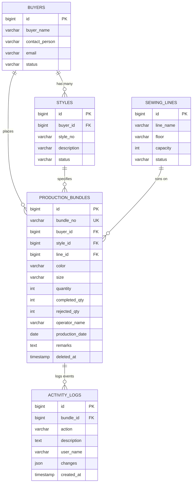

# 🧵 Apparel ERP - Production Bundle Management System

A high-performance **Production Bundle Management Module** engineered for Apparel Manufacturing ERP systems. Built with **PHP 8.4**, **Laravel 11**, **MySQL 8 / SQLite**, **Tailwind CSS**, and **Chart.js**, featuring live real-time metric computations, responsive AJAX workflows, comprehensive server-side validations, database indexing optimized for 50,000+ records, automated unit/feature tests, and RESTful API endpoints.

---

## 📸 User Interface & Features

- **Dashboard**: Executive KPIs (Total Bundles, Total Quantity, Today's Produced/Rejected Pulse, Total Completed & Defect Rate), interactive 7-Day Production Volume Bar Chart, OEE Average Efficiency Donut Chart, and Live Activity Log Feed.
- **Production Bundle Entry Form**: Dynamic cascading Style selector (auto-filtered by selected Buyer), instant real-time HUD calculation panel (Balance Qty, Efficiency %, Rejection %), anti-duplicate submission protection, and instant client/server validation.
- **Bundle Listing & Exploration**: Server-side paginated table (20, 50, 100 per page), multi-criteria search (Bundle #, Buyer, Style, Operator, Color), advanced filters (Buyer, Style, Line, Date Range), dynamic column sorting, and instant action modals.
- **Printable Garment Bundle Slip**: Thermal / A4 printable routing ticket with simulated barcode, routing metadata, quality breakdown, and operator/supervisor signature sign-off boxes.
- **Master Data Management**: Centralized management for Buyers, Styles, and Sewing Lines.
- **Activity Audit Trail**: Automated audit logging capturing every creation, edit, and deletion event with before/after state diffs.

---

## 🛠️ Technology Stack

- **Backend**: PHP 8.4+, Laravel 11 Framework
- **Database**: MySQL 8.0+ / SQLite (Fully compatible with pre-built SQL dump)
- **Frontend**: Blade Templating, Tailwind CSS, Lucide Icons, Chart.js
- **Asynchronous**: Native Fetch API / AJAX (zero full-page reloads for calculations & submissions)
- **API & Security**: RESTful JSON APIs, Laravel Sanctum, CSRF protection, SQL Injection protection via PDO parameter bindings
- **Testing**: PHPUnit / Pest Test Suite (19 automated tests, 71 assertions)

---

## 🗄️ Database Tables & Schema



### ⚡ Performance Indexing (50,000+ Record Optimization)
To guarantee sub-millisecond execution times over 50,000+ production records, composite and single-column B-Tree indexes are configured:
- `production_bundles.bundle_no` (UNIQUE Index)
- `(production_date, buyer_id)` (Composite Index for date range & buyer filtering)
- `(buyer_id, style_id)` (Composite Index for cascading buyer-style lookups)
- `(line_id, production_date)` (Composite Index for sewing line scheduling)
- `(deleted_at, created_at)` & `(deleted_at, production_date)` (Composite Index for soft delete filtering)
- `operator_name`, `color`, `size` (Single Column Search Indexes)

---

## 📐 Business Rules & Formulas

| Metric | Formula | Validation Constraint |
| :--- | :--- | :--- |
| **Balance Quantity** | `Quantity - Completed - Rejected` | `Balance >= 0` |
| **Efficiency %** | `(Completed / Quantity) * 100` | Rounded to 2 decimal places |
| **Rejection %** | `(Rejected / Quantity) * 100` | Rounded to 2 decimal places |
| **Total Quantity** | Input Value | `Quantity > 0` |
| **Sum Constraint** | `Completed + Rejected <= Quantity` | Server & Client-side validation |
| **Production Date** | Input Date | `Production Date <= Today` |

---

## 🚀 Installation & Setup Instructions

### 1. Clone or Extract the Project
```bash
git clone <repository-url> Bundle_management_system
cd Bundle_management_system
```

### 2. Install PHP Dependencies
```bash
composer install
```

### 3. Configure Environment File
```bash
cp .env.example .env
php artisan key:generate
```

### 4. Database Setup & Migration
The application supports both **SQLite** (instant zero-config) and **MySQL 8**.

#### Option A: Using Default SQLite (Instant)
```bash
# SQLite database is configured automatically in database/database.sqlite
php artisan migrate --seed
```

#### Option B: Using MySQL 8
1. Create a database named `bundle_management_system` in MySQL.
2. Update `.env`:
   ```ini
   DB_CONNECTION=mysql
   DB_HOST=127.0.0.1
   DB_PORT=3306
   DB_DATABASE=bundle_management_system
   DB_USERNAME=root
   DB_PASSWORD=your_password
   ```
3. Run migrations and seeder:
   ```bash
   php artisan migrate --seed
   ```
   *Alternatively, import the pre-generated database dump directly:*
   ```bash
   mysql -u root -p bundle_management_system < database/bundle_management_system.sql
   ```

### 5. Launch the Local Development Server
```bash
php artisan serve
```
Open your browser and visit: **`http://127.0.0.1:8000`**

---

## ⚡ High-Volume Performance Benchmark (50,000+ Records)

To test the application with a high-volume dataset, run the built-in batch generation command:
```bash
php artisan bundle:generate-50k 50000
```
This leverages chunked batch inserts (2,500 records per transaction) to generate **50,000 production bundles** in just ~8-12 seconds.

---

## 🧪 Automated Testing

Run the full PHPUnit / Pest test suite:
```bash
php artisan test
```

### Included Test Coverage:
1. **`BundleCalculationTest`**:
   - `test_balance_quantity_calculation`: Validates `Balance = Quantity - Completed - Rejected`.
   - `test_efficiency_percentage_calculation`: Validates `Efficiency = (Completed / Quantity) * 100`.
   - `test_rejection_percentage_calculation`: Validates `Rejection = (Rejected / Quantity) * 100`.
   - `test_zero_quantity_does_not_cause_division_by_zero`: Validates zero division protection.
   - `test_status_label_determination`: Validates status transitions (`PASSED`, `REJECTED`, `IN PROGRESS`, `PENDING`).
2. **`BundleValidationRulesTest`**:
   - `test_bundle_creation_requires_mandatory_fields`
   - `test_bundle_number_must_be_unique`
   - `test_quantity_must_be_greater_than_zero`
   - `test_completed_plus_rejected_cannot_exceed_total_quantity`
   - `test_production_date_cannot_be_in_the_future`
3. **`BundleApiTest`**:
   - `test_can_create_bundle_via_api` (with audit log trigger)
   - `test_can_list_and_search_bundles_via_api`
   - `test_can_get_single_bundle_via_api`
   - `test_can_update_bundle_via_api`
   - `test_can_soft_delete_bundle_via_api`
   - `test_dashboard_api_returns_aggregated_metrics`

---

## 📡 REST API Documentation

Base URL: `http://127.0.0.1:8000/api`

### 1. Dashboard Metrics
- **Endpoint**: `GET /api/dashboard`
- **Description**: Returns summary stats, completion rates, today's pulse, 7-day chart volume data, and recent bundle logs.

### 2. List Production Bundles
- **Endpoint**: `GET /api/bundles`
- **Query Parameters**:
  - `page` (int, default: 1)
  - `per_page` (int, 20/50/100)
  - `buyer_id` (int)
  - `style_id` (int)
  - `line_id` (int)
  - `date_from` (YYYY-MM-DD)
  - `date_to` (YYYY-MM-DD)
  - `search` (string: bundle no, operator, color, style)
  - `sort_by` (`bundle_no`, `buyer`, `style`, `quantity`, `efficiency`, `production_date`, `created_at`)
  - `sort_dir` (`asc` / `desc`)

### 3. Create Production Bundle
- **Endpoint**: `POST /api/bundles`
- **Headers**: `Content-Type: application/json`, `Accept: application/json`
- **Sample Request Body**:
  ```json
  {
    "bundle_no": "BN-1042",
    "buyer_id": 1,
    "style_id": 1,
    "line_id": 1,
    "color": "Navy",
    "size": "M",
    "quantity": 500,
    "completed_qty": 480,
    "rejected_qty": 15,
    "operator_name": "John Miller",
    "production_date": "2026-08-26",
    "remarks": "High efficiency lot"
  }
  ```

### 4. Get Bundle Details
- **Endpoint**: `GET /api/bundles/{id}`

### 5. Update Production Bundle
- **Endpoint**: `PUT /api/bundles/{id}`

### 6. Delete Production Bundle (Soft Delete)
- **Endpoint**: `DELETE /api/bundles/{id}`

### 7. Export CSV / Excel
- **Endpoint**: `GET /api/bundles-export`

### 8. Master Data Endpoints
- `GET /api/buyers`
- `GET /api/styles?buyer_id={id}`
- `GET /api/sewing-lines`

---

## 📦 Submission Deliverables Reference

1. **Complete Source Code**: Fully documented, PSR-12 compliant Laravel 11 implementation.
2. **SQL Database Dump**: Located at [`database/bundle_management_system.sql`](file:///c:/Users/Pooja/Downloads/Bundle_management_system/database/bundle_management_system.sql).
3. **Postman API Collection**: Located at [`Bundle_Management_System_API.postman_collection.json`](file:///c:/Users/Pooja/Downloads/Bundle_management_system/Bundle_Management_System_API.postman_collection.json).
4. **Setup Documentation**: This `README.md`.
5. **Git Repository**: Initialized with clean, structured commits.